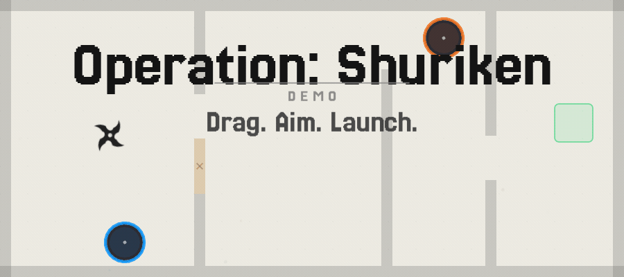
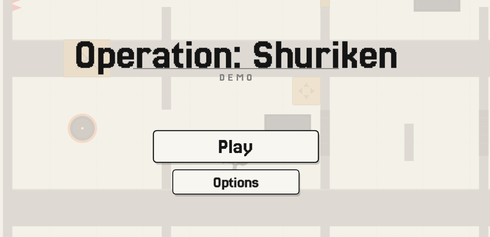
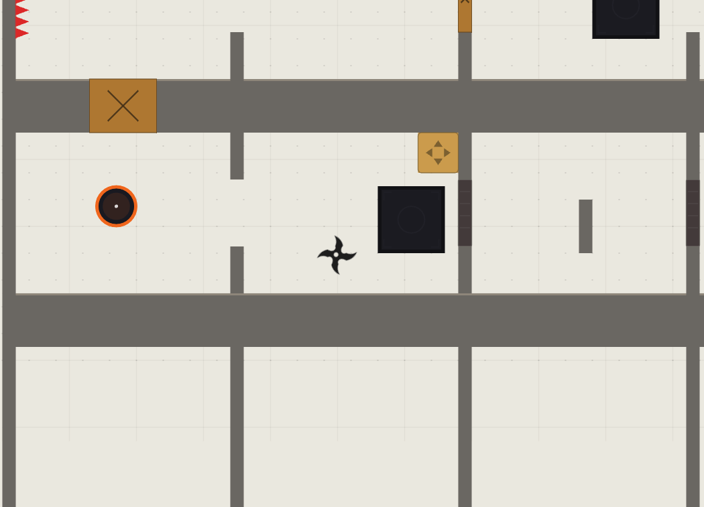
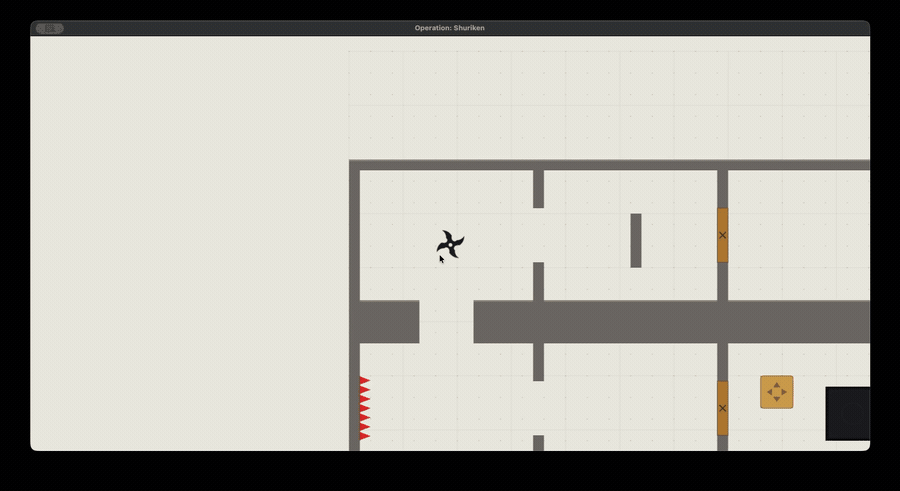

# Operation Shurkin

A small hobby puzzle game about fast movement and drag-to-aim shuriken throws. Built for long, brain-first levels with a cozy vibe and quick resets.

<p align="center">
  
</p>

<p align="center">
  <a href="#gameplay">Gameplay</a> •
  <a href="#screenshots">Screenshots</a> •
  <a href="#running-locally">Run It</a> •
  <a href="#project-layout">Project Layout</a> •
  <a href="#web-build">Web Build</a>
</p>

---

## What it is

Operation Shurkin is a personal/hobby project focused on clean, satisfying, and rewarding gameplay.

## Gameplay

**Core input** — Drag to aim, release to throw.

**Level objects**
- **Breakable walls** — shatter on impact
- **Buttons** — activated by shuriken hits or crate weight
- **Pushable blocks** — hold buttons down permanently
- **Portals** — paired teleporters, objects pass through intact
- **Spikes** — instant reset on contact

**12 levels** across 3 acts, ramping from simple throws to multi-portal routing puzzles.

---

## Screenshots

### Main Menu
<p align="center">
  
</p>

### In-Game
<p align="center">
  
</p>

### Gameplay
<p align="center">
  
</p>

---

## Running locally

Requires [LÖVE 11.5](https://love2d.org/).

```bash
# Clone the repo
git clone https://github.com/junerhobart/operation-shuriken.git
cd operation-shuriken

# Run
love .

# Run with dev mode (level designer + all levels unlocked)
love . --dev
```

### Controls

| Input | Action |
|---|---|
| Drag + release | Aim and throw |
| R | Restart level |
| ESC | Back / level select |
| Scroll / +− | Zoom |
| E (dev mode) | Level designer |

Mobile uses tap and drag throughout.

---

## Project layout

```
main.lua            game loop, state machine, callbacks
conf.lua            window config, mobile detection
src/
  core/
    globals.lua     global state
    level.lua       save/load, level management
    audio.lua       music and sound
  game/
    player.lua      movement, drag, trajectory preview
    world.lua       rendering walls, portals, doors, spikes
    particles.lua   particle effects
  ui/
    handlers.lua    input callbacks
    menu.lua        main menu
    levelselect.lua mission select screen
    story.lua       story + death screens
    options.lua     settings UI
    victory.lua     level complete overlay
    buttons.lua     animated button widget
    layout.lua      UI scaling, letterbox
    editor/         level designer (dev mode)
  levels/
    init.lua        level registry
    level1–12.lua   level data
  utils/
    constants.lua   physics tuning, colours
    physics.lua     circle vs AABB collision
    utils.lua       math helpers
assets/
  fonts/            Jersey25
  audio/            music loops + sound effects
  images/           shuriken sprite
```

---

## Web build

Built with [love.js](https://github.com/Davidobot/love.js). The `web-build` branch is deployed on GitHub Pages.

```bash
# Package
zip -9 -r game.love . -x ".git/*" "build/*" "banner/*" "docs/*" "*.md" ".DS_Store"

# Build
npx love.js -t "Operation Shuriken" -m 67108864 game.love build/web/

# Serve locally (needs COOP/COEP headers for SharedArrayBuffer)
python3 build/web/serve.py 8080
```

