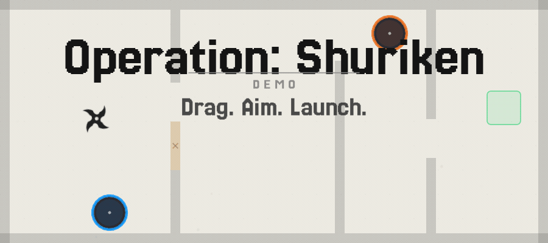

# Operation: Shuriken

Physics-based puzzle game: you launch a shuriken by dragging to aim and releasing. Bounce through 12 levels and reach the exit.

## Screenshots

## Gameplay

- **Control:** Drag to aim, release to launch. You bounce off walls and keep momentum. Plan your path.
- **Level elements:** Breakable walls (smash through at speed), pallets (push onto buttons), buttons (open doors), portals (A/B pairs), spikes (instant death), exit (goal).
- **Flow:** Level select, pre/post story text per level. Progress is saved in `save.txt`.

## How to run

- **Desktop:** [LÖVE](https://love2d.org/) 11.4. From the project root: `love .`
- **Dev mode:** `love . --dev` — enables the level editor (press **E** on the main menu).
- **Web:** Builds via love.js in CI; playable from the `web-build` branch or wherever that build is deployed.

## Controls

- **Mouse / touch:** Drag to aim and launch. On touch devices, two-finger pinch to zoom.
- **Keyboard:** **R** = restart level (in game). **Escape** = level select (in game) or back (options). In dev mode, **E** on menu = editor; arrow keys pan the camera in the editor.

## Options

Music/SFX volume, screen shake, drag sensitivity, dark mode, fullscreen, vsync, speedrun timer (active time and total time). Stored in `settings.txt`.

## Level editor (dev only)

Run with `--dev`, then press **E** on the main menu. Place and edit walls and level elements; arrow keys pan. Drop a `.lua` file onto the game window: if it returns a level table (same shape as the level files in `src/levels/`), the game loads it and starts playing.

## Stack

LÖVE 11.4, Lua. Custom physics (no LÖVE physics module).